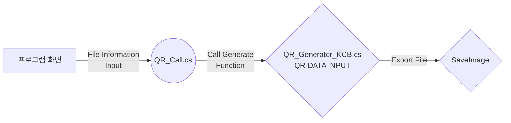

# QR Creator
QR 코드를 생성하는 유니티 프로그램입니다.
ZXing 오픈 라이브러리를 사용하였으며, PNG 형태와 JPG 형태로 추출이 가능합니다.

## 실행 설명
> OS : Window 10

 1. 다운로드 받은 폴더 중 **"EXE"** 폴더를 오픈합니다.
 2. **"QR_Maker.exe"** 파일을 실행합니다.
 3. **"파일 이름"** 탭에 생성할 QR 코드 텍스처 파일의 이름을 설정합니다. (영어)
 4. **"파일 내용"** 탭에 QR 코드 내부에 저장할 텍스트를 입력합니다.   이 때 웹 주소를 입력해도 정상 작동합니다.
 5. **"PNG"** 버튼과 **"JPG"** 버튼 중, 원하는 형식의 버튼을 클릭합니다.
 6. exe 파일을 실행 한 폴더에서, **"SaveImages"** 폴더를 찾아 오픈합니다.
 7. 저장 된 QR 코드 텍스처를 확인합니다.

## 디버그 설명
> Note :  Develop Unity Version :  **2020.1.17f1** 
> 소스 코드에 대한 설명은 전부 주석 처리되어있습니다.

 1. 우선, 유니티 프로젝트를 실행합니다.
 2. Assets 아래 **"QR_Generate_KCB-Scene"** 씬을 더블 클릭하여 오픈합니다.
 3. Hierarchy 창 아래 **Canvas/Input Form/ File-Name & File-Text** 두 개의 인풋 필드가   QR 파일의 이름과 내용이 됩니다.
 4. Scripts 아래 **"QR_Call"** 파일은 단순히 입력한 값을 메모리에 저장하는 브릿지 스크립트입니다.
 5. Scripts 아래 **"QR_Generator_KCB"** 파일은 ZXing을 이용한 제네레이트 함수가 포함 된 스크립트입니다.  실제 QR코드를 생성하고 저장하는 내용을 담고 있습니다.

## 진행 순서

